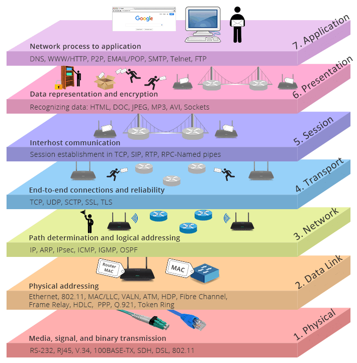
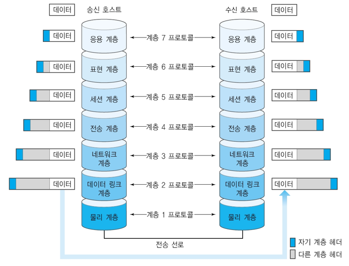
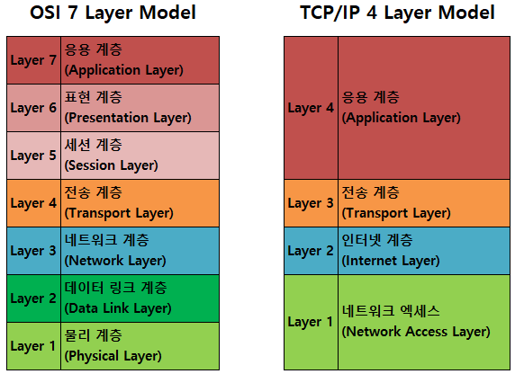
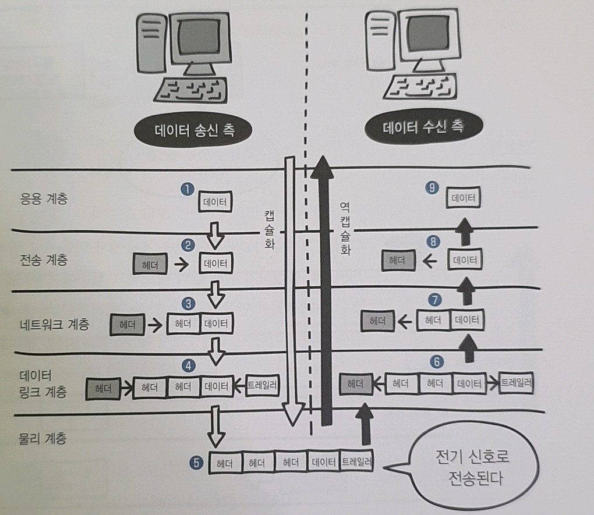
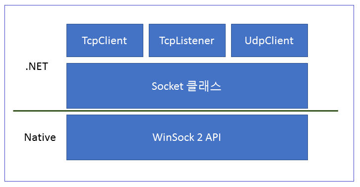
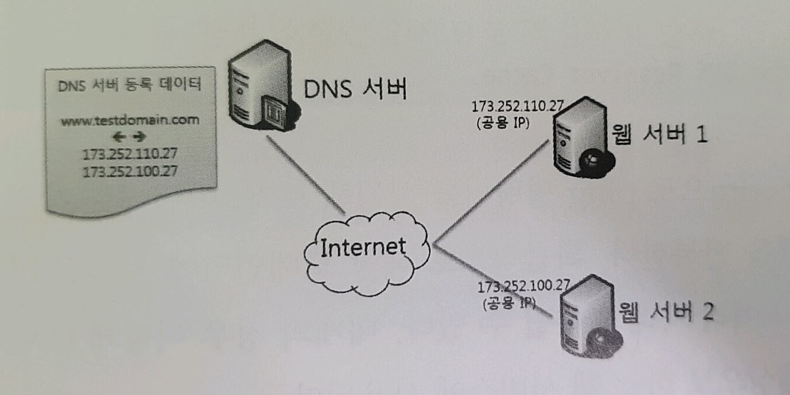

# ✍️ 0. 기본 개념

## 💡 목차

- 네트워크 모델
  - 프로토콜
  - OSI 모델과 TCP/IP 모델
  - 캡슐화와 역캡슐화
- WinSocket과 .NET 클래스
  - 소켓 API
  - WinSock API
  - .NET 네트워크 클래스
- IP 주소와 호스트
  - IP 주소 (`System.Net.IPAddress`)
  - DNS (`System.Net.Dns`)
  - IP 종단점 (`System.Net.IPEndPoint`)
  
  

## 📝 네트워크 모델

네트워크의 세부 기능들은 매우 복잡하고 다양하기 때문에, 이를 체계적으로 분류한 개념적인 모델을 만들었는데 이를 **네트워크 모델**이라고 한다.

  

### ✏️ 프로토콜

통신하기 위한 규칙

  

### ✏️ OSI 모델과 TCP/IP 모델



  

#### ⬛️ OSI 모델

- 과거엔 같은 회사의 컴퓨터끼리만 통신이 가능했던 시절이 있었음!

  ▶ ISO 라는 국제표준화기구에서 `OSI 모델`이라는 표준 규격을 제정

- `OSI 모델`은 네트워크 기술의 기본이 되는 모델

- **데이터의 송수신은 컴퓨터에서 컴퓨터로 데이터를 전송하는 것**! 

  이때 컴퓨터 내부에서는 여러 가지 일을 하는데, 이런 일을 **7개의 계층으로 나눠서** 한다.


| 계층  | 이름       | 설명       | 요약         |
|---|---|---|---|
| **7계층** | 응용 계층(Application Layer)      | 이메일&파일 전송, 웹 사이트 조회 등 애플리케이션에 대한 서비스를 제공한다. | 정확하게 데이터 송수신                    |
| **6계층** | 표현 계층(Presentation Layer)     | 문자 코드, 압축, 암호화 등 데이터를 변환한다.                | 효율 및 정형(압축, 데이터 교환)       |
| **5계층** | 세션 계층(Session Layer)          | 세션 체결, 통신 방식을 결정한다.                             | 경로 제어(세션 유지, 해방)                |
| **4계층** | 전송 계층(Transport Layer)        | 신뢰할 수 있는 통신을 구현한다.                              | 신뢰성(접속 확립, 재 전송제어, 순서 제어) |
| **3계층** | 네트워크 계층(Network Layer)      | 다른 네트워크와 통신하기 위한 경로 설정 및 논리 주소를 결정한다. | 경로 선택(최적 경로 탐색)                 |
| **2계층** | 데이터 링크 계층(Data Link Layer) | 네트워크 기기 간의 데이터 전송 및 물리 주소를 결정한다.      | 에러 제어(혼잡 제어, 흐름 제어)           |
| **1계층** | 물리 계층(Physical Layer)         | 시스템 간의 물리적인 연결과 전기 신호를 변환 및 제어한다.    | 신호 교환                                 |

  



  

- 데이터를 전송하는 송신 측은 데이터를 보내기 위해서 상위 계층에서 하위 계층으로 데이터를 전달한다. 

  (7계층 → 1계층)

- 데이터를 받는 수신 측은 하위 계층에서 상위 계층으로 각 계층을 통해 전달된 데이터를 받게된다.

  (1계층 → 7계층)

- 각 계층은 독립적이므로 데이터가 전달되는 동안에 다른 계층의 영향을 받지 않는다.

  

#### ⬛️ TCP/IP 모델

- 최근의 네트워크 거의 대부분은 TCP/IP를 기반으로 하고 있으며, OSI 7 계층을 4계층으로 단순화한 TCP/IP 모델이 있다.

| 계층      | 이름                 | 설명                                                         |
| --------- | -------------------- | ------------------------------------------------------------ |
| **4계층** | Application Layer    | TCP/UDP 상에 구현되는 응용 계층을 담당하는 계층으로 SSL/TLS, HTTP, FTP, DNS 등 여러가지 응용 프로토콜이 이 계층에 속한다. |
| **3계층** | Transport Layer      | OSI 모델의 전송 계층과 같은 것으로, TCP/UDP를 통해 **호스트 내 특정 포트에 접속**하게 하는 계층이다. IP 계층이 특정 호스트(머신)까지 찾아가는 것을 담당한다면, TCP/UDP 계층은 그 머신의 어떤 포트에 접속해야 하는지를 결정하는 데 이를 통해 실제 양쪽 프로그램 간 통신이 가능하게 되므로 이를 End-to-End Transport 프로토콜이라 한다. |
| **2계층** | Internet Layer       | OSI 모델의 네트워크 계층과 같은 것으로 **IP 주소를 통한 호스트 라우팅을 담당**하는 계층이다. |
| **1계층** | Network Access Layer | 물리적인 네트워킹을 담당하는 계층이다.                       |

  



  

#### ⬛️ 캡슐화와 역캡슐화

데이터를 송수신할 때는 캡슐화와 역캡슐화가 이루어진다.

- 데이터를 보낼 때는 필요한 정보(ex. 데이터를 전달받을 상대방에 대한 정보)를 데이터에 추가해야하는 데 이 정보를 **헤더**라고 한다.
- 데이터를 상대방에게 보낼 때 각 계층에서 헤더(혹은 데이터 링크 계층의 트레일러)를 붙여 나가는 것을 **캡슐화**라고 한다.
  - ex) 전송 계층에서 신뢰할 수 있는 통신이 이루어지도록 응용 계층에서 만들어진 데이터에 헤더를 붙임
- 데이터를 수신할 때 각 계층에서 헤더(혹은 데이터 링크 계층의 트레일러)를 제거해 나가는 것을 **역캡슐화**라고 한다.
  - ex) 송신 측에 데이터 링크 계층에서 추가된 헤더와 트레일러를 수신 측인 데이터 링크 계층에서 제거
- 송신 측의 데이터 링크 계층에서 만들어진 데이터가 전기 신호로 변환되어 수신 측에 전송된다.
- 이렇게 네트워크에서는 데이터를 전달하기 위한 여러가지 규칙이 있어서 데이터를 문제없이 전달할 수 있다!



  

🙋🏼 잠깐! : 트레일러

트레일러란, 데이터를 전달할 때 데이터의 마지막에 추가하는 정보를 의미한다.

  

## 📝 WinSocket과 .NET 클래스

### ✏️ 소켓 API

- 네트워크 프로그래밍에 있어서 `소켓(socket)`은 네트워크 표준  API로 여겨지고 있다.
- `소켓(socket)`은 버클리 유닉스(BSD Unix)에서 처음 개발되었으며, 다양한 OS에서 네트워크 표준으로 사용되고 있다.

  

### ✏️ WinSock API

- 마이크로소프트는 버클리 유닉스 소켓 API를 윈도우에서 구현한 `WinSock 1.1`(Windows Sockets API)을 1992년에 출시했다. 현재는 `WinSock 2`(WinSock 2.x)을 사용하고 있다.

  

### ✏️ .NET 네트워크 클래스



- .NET 프레임워크는 `WinSock API`를 사용하기 위한 Wrapper 클래스들을 제공하고 있는데, 핵심 클래스로 `System.Net.Sockets` 네임스페이스 안에 있는 `TcpClient`, `TcpListener`, `UdpCLient`, `Socket`  클래스들이 있다.

  - `TcpClient`는 TCP 클라이언트를 위한 기능 제공
  - `TcpListener`는 TCP 서버에 대한 기능 제공
  - `UdpClient`는 UDP 클라이언트와 서버 기능을 제공
  - `Socket` 클래스는 Low Level의 소켓 프로그래밍 기능을 제공

- `TcpClient`, ` TcpListener`, `UdpClient`는 내부적으로 `Socket` 클래스를 사용하고, `Socket 닷넷` 클래스는 `WinSockAPI`를 호출한다.

​    

## 📝 IP 주소와 호스트

### ✏️ 전화 통신과 컴퓨터 통신의 비교

|       | 전화를 이용한 사람 간의 통신                                 | 네트워크 어댑터를 이용한 컴퓨터 간의 통신                    |
| ----- | ------------------------------------------------------------ | ------------------------------------------------------------ |
| **1** | 홍길동은 홍길순에게 전화를 걸기 위해 전화번호부에서 홍길순을 찾는다. | 사용자 PC는 네이버에 접속하고자한다. 사용자는 네이버의 도메인 네임이 www.naver.com 인 것을 알고 있으며, DNS 서버에 그에 해당하는 IP 주소를 요청한다. |
| **2** | 홍길순의 전화번호가 013-1200-3001 임을 알아낸다.             | DNS 서버는 내부 저장소(DNS 테이블)로부터 www.naver.com의 IP 주소를 찾아서 사용자 PC에 전달한다. |
| **3** | 전화기를 이용해 013-1200-3001 번호를 눌러 홍길순과 통화한다. | 네트워크 어댑터는 대상 IP 주소가 네이버에 해당하는 202.179.177.21 로 통신을 시작한다. |
|       |  |  |

| 전화 통신  | 컴퓨터 통신                          | 설명                                                         |
| ---------- | ------------------------------------ | ------------------------------------------------------------ |
| 전화기     | 네트워크 어댑터(Network Adapter)     | 컴퓨터에 보통 LAN 카드라고 내장돼 있는 것이 네트워크 어댑터에 해당한다. |
| 전화번호   | IP 주소(IP Address)                  | IP 주소는 4바이트의 숫자다. 사람이 쉽게 인식할 수 있도록 1바이트씩 점(.)을 이용해서 구분해 표기한다. 예를 들면, 10.10.10.200과 같은 식이며 각 자리 수는 1바이트이므로 0 ~ 255 사이의 값을 갖는다. |
| 사람 이름  | 도메인 이름(Domain Name)             | 4개의 숫자로 나눠서 IP 주소를 표기하는 것도 쉽게 기억하기 힘들기 때문에, IP 주소마다 이름을 부여해서 관리한다. |
| 전화번호부 | 도메인 네임 서버(Domain Name Server) | 도메인 이름과 그에 대응되는 IP 주소 정보를 보관하고 있는 컴퓨터 |


### ✏️ IP 주소, DNS, IP 종단점

이러한 네트워크 기본 클래스들은 .NET의 `System.Net` 네임스페이스에 있는데, 이러한 기능을 구현한 `IPAddress`, `Dns`, `IPEndPoint` 클래스 등에 대해 살펴보자!

  

#### ⬛️ IP 주소 (`System.Net.IPAddress`)

- IP 주소는 인터넷에 연결된 컴퓨터들의 주소
- .NET에서 IP 주소를 사용하기 위해서는 `System.Net`의 `IPAddress`클래스를 사용한다.

| IPv4                       | IPv6                                     |
| -------------------------- | ---------------------------------------- |
| 가장 많이 사용되는 IP 버전 | IPv4 주소가 모자랄 것을 대비해 만든 주소 |
| 32비트(4 바이트)           | 128비트(16바이트)                        |
| 191.239.213.197            | 2001:0db8:85a3:0042:1000:8a2e:0370:7334  |

  

가장 일반적인 IPv4 주소를 예를 들면, 

- IP 주소 문자열로부터 파싱해서 IPAddress 객체를 만들거나,

```c#
// using System.Net;
IPAddress ip1 = IPAddress.Parse("192.169.1.13");
```

- 혹은, 바이트 배열 혹은 정수를 직접 IPAddress 생성자에 넣어 IPAddress 객체를 만들 수도 있다!
- `IPAddress` 객체로부터 `ToString()` 메서드를 호출하면 `"192.168.1.13"`과 같은 표현으로 IP가 출력된다.
```c#
IPAddress ip2 = new IPAddress(new byte[] {192, 168, 1, 13});
IPAddress ip2 = new IpAddress(218212544);
Console.WriteLine(ip3.ToString()); // "192.168.1.13" 출력
```

  

🙋🏼 잠깐! : `Parse()`

```c#
// Parse()
// 숫자로 변환할 문자열을 넘기면 숫자로 변환
int a = int.Parse(12345);
float b = float.Parse(123.45);
```

🙋🏼 잠깐! :  `ToString()`

```c#
// ToString()
// 숫자 데이터 형식을 문자열로 변환
// 정수 계열 데이터 형식이나 부동 소수점 데이터 형식은 object로부터 물려받은 ToString 메서드를 오버라이드 즉, 자신이 갖고 있는 숫자를 문자열로 변환하도록 재정의
int c = 12345;
string d = c.ToString();

float e = 123.45;
string f = e.ToString();
```

🙋🏼 잠깐! : 유용한 `IPAddress` 메서드

```c#
// 유용한 IPAddress 메서드
IPAddress ip = IPAddress.Parse("216.58.216.174");
byte[] ipbytes = ip.GetAddressBytes(); // IP를 바이트 배열로
IPAddress ipv6 = ip.MapToIPv6(); // IPv4를 IPv6로 매핑
```

  

#### ⬛️ DNS (`System.Net.Dns`)

- 보통 IP 주소를 기억하기 힘들기 때문에 호스트명을 사용해 어떤 컴퓨터인지를 표현
  - 로컬 네트워크에서는 컴퓨터명이 호스트명 ex) wooriPC
  - 인터넷상에서는 도메인 이름이 호스트명 ex) www.google.com

  

##### 호스트/도메인명에서 IP 주소 얻기

- 호스트/도메인명을 IP주소로 변경하기 위해서는 `DNS`(Domain Name Server)를 사용
- .NET에서는 `Dns` 클래스를 통해 호스트 정보를 얻어올 수 있다.
  - `Dns.GetHostEntry(호스트명)` 메서드는 정적메서드로서, 호스트명에 대한 IP 정보, Alias 정보 등을 리턴하는데 이렇게 리턴되는 정보를 `IPHostEntry` 객체에 담게 된다.
  - 해당 호스트에 대한 IP 주소는 **복수 개** 일 수도 있으므로, `IPHostEntry` 객체의 `AddressList` 속성에 `IPAddress[]` 배열의 형태로 저장된다. (핸드폰에 저장된 친구가 여러 개의 전화번호를 가지고 있는 것과 같은 식으로 생각하면 된다. 집 전화, 핸드폰, 회사 전화 등이 하나의 이름으로 묶여 있는 경우처럼 도메인 네임 하나에 여러 개의 IP가 묶인 것이다.)
```c#
// 호스트/도메인명에서 IP 알아내기
IPHostEntry hostEntry = Dns.GetHostEntry("www.google.com");

Console.WriteLine(hostEntry.HostName);

foreach (IPAddress ip in hostEntry.AddressList)
{
    Console.WriteLine(ip);
}

// 로컬 호스트명 정보 얻기
string hostname = Dns.GetHostName();
IPHostEntry localhost = Dns.GetHostEntry(hostname);
```

  

- 도메인 이름을 사용할 때의 단 한가지 단점이라면, DNS로부터 IP 주소를 조회해야 하기 때문에 그만큼 속도가 저하된다는 것이다. 
  
- 이 때문에 윈도우 운영체제에서는 내부적으로 한번 조회된 적이 있는 도메인명과 IP주소는 일정 시간 동안 저장해 두는 기능이 있다. 그래서 다음 번에 동일한 DNS 조회 요청이 오면 서버와의 통신 없이 미리 저장해 둔 IP 주소를 곧바로 반환함으로써 속도를 향상시킨다.
  
- 1개의 도메인명에 N개의 IP가 묶인 경우 일종의 부하 분산(load balance)역할을 하기도 한다.

  - 예를 들어, 다음과 같이 2개의 웹 서버에 각각 IP를 할당하고 동일한 도메인으로 묶었다고 가정해 보자.

  - 이렇게 구성된 상태에서 사용자의 컴퓨터에서 www.testdomain.com을 조회하면 어떤 사용자는 173.252.110.27을 내려받을 수도 있고, 다른 사용자는 173.252.100.27을 내려받을 수도 있다.

    

  

🙋🏼 잠깐! : 'Resolve is obsoleted for this type'

- obsoleted : 더 이상 쓸모가 없는, 구식의

```c#
// BasicSocketServer와 BasicSocketClient에서의 Resolve()
// 'Resolve is obsoleted for this type'이라고 나오며

// 28번째 줄을
IPHostEntry ipHostInfo = Dns.Resolve(Dns.GetHostName());

// 아래와 같이 바꿔줄 수 있다
IPHostEntry ipHostInfo = Dns.GetHostEntry(Dns.GetHostName());
```

  

#### ⬛️ EndPoint (`System.Net.IPEndPoint`)

- TCP나 UDP는 IP 주소와 함께 포트번호를 사용한다. 이러한 종단점(EndPoint)을 표현하기 위해 `IPEndPoint` 클래스를 사용한다. 
- `IPEndPoint`는 **IP주소와 포트번호의 조합**으로, `ToString()` 메서드를 호출하면 **"IP주소:포트번호"** 형식으로 문자열을 리턴한다.

```c#
IPAddress ip = IPAddress.Parse("74.125.28.99");
IPEndPoint ep = new IPEndPoint(ip, 80);

Console.WriteLine(ep.ToString()); // "74.125.28.99:80" 출력
```

  
