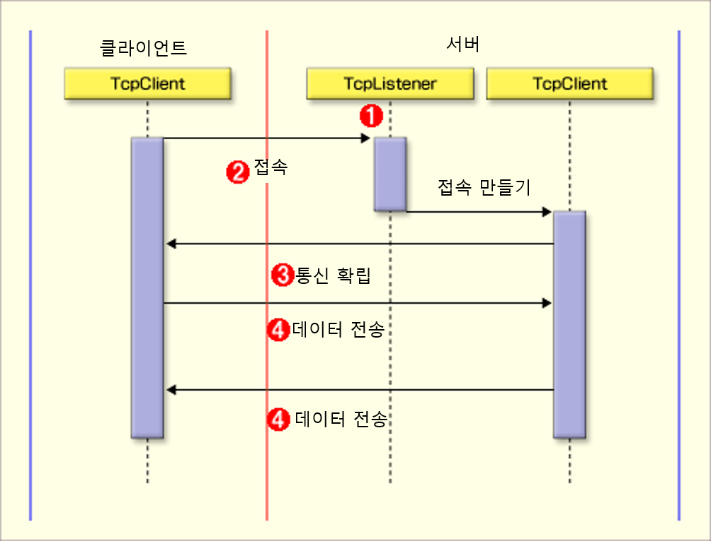

# ✍️ 2. TcpClient와 TcpListener

## 💡 목차

- TCP 클라이언트와 TCP 서버
  
  - `TcpClient` 클래스
  - `TcpListener` 클래스
  
  


##  📝 TCP 클라이언트와 TCP 서버

- [이미지 출처](http://www.atmarkit.co.jp/fdotnet/special/networkprog/networkprog03.gif)



​    

### ✏️ `TcpClient` 클래스

- `.NET Framework` 에서  TCP 클라이언트 프로그램을 개발하기 위해서는 `System.Net.Sockets.TcpClient` 클래스를 사용할 수 있다.

- `TcpClient` 클래스는 내부적으로 `System.Net.Sockets.Socket` 클래스 기능들을 사용해 TCP 기능을 구현하고 있다.

- TCP는 기본적으로 IP와 포트를 필요로 하는데, IP가 호스트까지 연결하는데 비해, **TCP는 호스트 내 포트까지 연결하여 해당 포트에서 기다리고 있는 응용프로그램까지 도달**한다.

    


> 아래 예제는 간단한 메시지를 TCP 서버에 보내고, 응답을 읽어 화면에 표시하는 간단한 프로그램이다.

```c#
using System;
using System.Net.Sockets;
using System.Text;
 
namespace TcpClient
{
    class Program
    {
        static void Main(string[] args)
        {
            // 1. IP 주소와 포트를 지정하고 TCP 연결 
            TcpClient tc = new TcpClient("127.0.0.1", 7000);
            //TcpClient tc = new TcpClient("localhost", 7000);
 
            string msg = "Hello World";
            byte[] buff = Encoding.ASCII.GetBytes(msg);
 
            // 2. NetworkStream을 얻어옴 
            NetworkStream stream = tc.GetStream();
 
            // 3. 스트림에 바이트 데이타 전송
            stream.Write(buff, 0, buff.Length);
 
            // 4. 스트림으로부터 바이트 데이타 읽기
            byte[] outbuf = new byte[1024];
            int nbytes = stream.Read(outbuf, 0, outbuf.Length);
            string output = Encoding.ASCII.GetString(outbuf, 0, nbytes);
 
            // 5. 스트림과 TcpClient 객체 닫기
            stream.Close();
            tc.Close();
 
            Console.WriteLine($"{nbytes} bytes: {output}");
        }
    }
}
```

1. TCP 클라이언트가 서버에 연결하기 위해서는 IP 주소와 포트가 필요하다. 

   예제와 같이 `TcpClient 생성자`에서 **IP와 포트**를 주면 자동으로 TCP Connection을 연결한다.

   (생성자에 파라미터를 주지 않은 경우 나중에 `Connect()`메서드를 호출해 명시적으로 연결할 수도 있다.)

2. `TcpClient`의 `GetStream()` 메서드는 **TCP 네트워크 스트림을 리턴**한다. 

   이 네트워크 스트림을 이용해 네트워크로 데이타 송수신을 하게된다.

3. `NetworkStream`의 `Write()` 메서드를 사용해 바이트들을 서버로 보낸다. 

   - 네트워크 데이타 송수신은 기본적으로 바이트 데이타를 사용하는데, 따라서 문자열을 보낼 경우 먼저 바이트로 인코딩한 후 보내게 된다.
   - 일반 영문은 ASCII로 인코딩하고, 한글 등 비영문 문자열은 UTF 인코딩을 사용할 수 있다. 
   - [Encoding Class](https://docs.microsoft.com/en-us/dotnet/api/system.text.encoding?view=netframework-4.8)

4. `NetworkStream`의 `Read()` 메서드를 사용해 바이트 데이타를 서버에서 읽어온다.
   
   - 예제에서는 개념을 설명하기 위해 `Read()`를 한번만 호출했지만, 일반적으로  TCP에서 데이타를 보내면 실제로는 여러번 나뉘어져 보내질 수 있으므로 보통 루프를 만들어 모든 데이타를 `Read()`하고 읽기를 끝내게된다.
5. 마지막으로 `NetworkStream`을 닫고 `TcpClient` 객체를 닫는다. 
   - 일반적으로 이 둘을 모두 명시적으로 닫는다.
   - ⚠️ `NetworkStream`만 닫으면 네트워크 스트림의 하위 리소스인 `TcpClient`를 같이 닫게 되지만, 반대로 `TcpClient` 객체만 닫으면 `NetworkStream`을 닫지 않으므로 주의해야한다.

​    

### ✏️ `TcpListener` 클래스

- `.NET Framework`에서 TCP 서버 프로그램을 개발하기 위해서는 `System.Net.Sockets.TcpListener` 클래스를 사용한다.

- `TcpListener` 클래스는 내부적으로 `System.Net.Sockets.Socket` 클래스 기능들을 사용해 TCP Port Listening 기능을 구현하고 있다.

  - TCP 서버는 `TcpListener` 클래스를 통해 포트를 열고

  - `TcpListener.AcceptTcpClient()` 메서드를 통해 클라이언트 접속을 대기하고 있다가

  - 접속 요청이 오면 이를 받아들여 `TcpClient` 객체를 생성해 리턴한다.

  - 이후 서버의 `TcpClient` 객체가 클라이언트와 직접 네트워크 스트림을 통해 통신하게 된다.

  - (참고로 `AcceptTcpClient()` 대신 `AcceptSocket()`을 사용할 수 있는데, 이를 통해 `TcpClient` 객체 대신 Low Level의 `Socket` 객체를 사용할 수 있다.)

      

> 아래 예제는 TCP 클라이언트로부터 수신한 메시지를 그대로 돌려보내는 간단한 Echo 서버이다.

```c#
using System.Net.Sockets;
using System.Net;

namespace TcpServer
{
    class Program
    {
        static void Main(string[] args)
        {
            // 1. 로컬 포트 7000을 Listen
            TcpListener listener = new TcpListener(IPAddress.Any, 7000);
            listener.Start();

            byte[] buff = new byte[1024];

            while (true)
            {
                // 2. TcpClient Connection 요청을 받아들여
                // 서버에서 새 TcpClient 객체를 생성해 리턴
                TcpClient tc = listener.AcceptTcpClient();
                
                // 3. TcpClient 객체에서 NetworkStream을 얻어옴
                NetworkStream stream = tc.GetStream();
                
                // 4. 클라이언트가 연결을 끊을 때까지 데이타 수신
                int bytes;
                while ((bytes = stream.Read(buff, 0, buff.Length)) > 0)
                {
                    // 5. 데이타 그대로 송신
                    stream.Write(buff, 0, bytes);
                }
                
                // 6. 스트림과 TcpClient 객체 닫음
                stream.Close();
                tc.Close();
                
                // 7. 계속 반복
            }
        }
    }
}
```

1. TCP 서버에서 포트를 열고 Listening 하기 위해 `TcpListener` 생성자에 `IPAddress`와 포트번호를 지정한다. `TcpListener` 객체 생성 후 실제 Listening을 시작하기 위해서 `Start()` 메서드를 호출한다.

   - `IPAddress.Any`는 `0.0.0.0`을 가리키는 것으로 **로컬 머신의 모든 IPAddress에 대해 Listening을 할 경우** 사용한다.

2. Listening을 시작한 후, 일반적으로 무한 루프를 만들어 서버가 계속 클라이언트 연결 요청을 처리하도록 한다. 

   - 루프 안에서 `TcpListener` 객체의 `AcceptTcpClient()` 메서드를 사용하면 TcpClient Connection 요청이 올 때까지 대기했다가, 요청이 들어오면 요청을 수용하고 서버에 새 `TcpClient` 객체를 생성해 리턴한다. 
   - 이렇게 생성된 `TcpClient` 객체를 통해 클라이언트와 통신하게 된다. 
   - 위 예제는 동기적으로 클라이언트 요청을 하나씩 처리하는 예이다.

3. `TcpClient` 객체의 `GetStream()` 메서드는 TCP 네트워크 스트림을 리턴한다. 이 네트워크 스트림을 이용해서 네트워크로 데이타 송수신을 하게된다.

4. `NetworkStream`의 `Read()` 메서드를 사용하여 클라이언트 데이터를 읽어온다.
- 위의 Echo 서버 예제에서는 클라이언트가 Connection을 끊을 때까지 서버는 계속 읽는다는 프로토콜을 구현한 것이다.
  
5. `NetworkStream`의 `Write()` 메서드를 사용하여 데이타를 클라이언트에 보낸다.

6. 마지막으로 `NetworkStream`을 닫고, `TcpClient` 객체를 닫는다.

