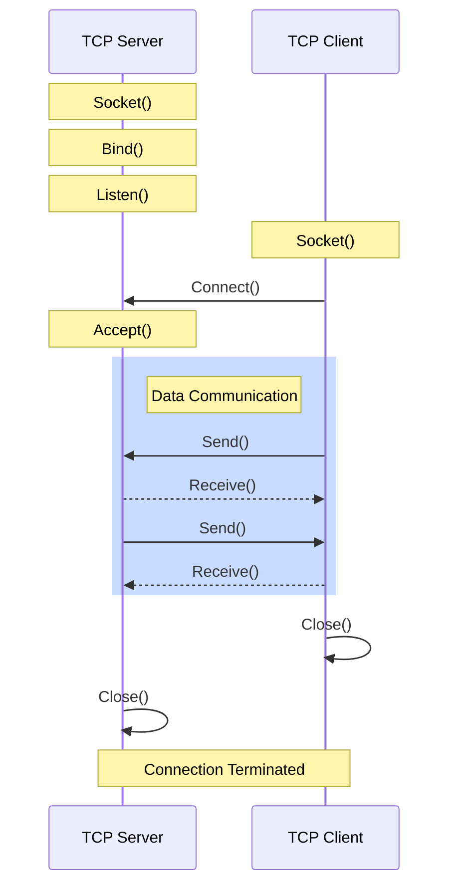
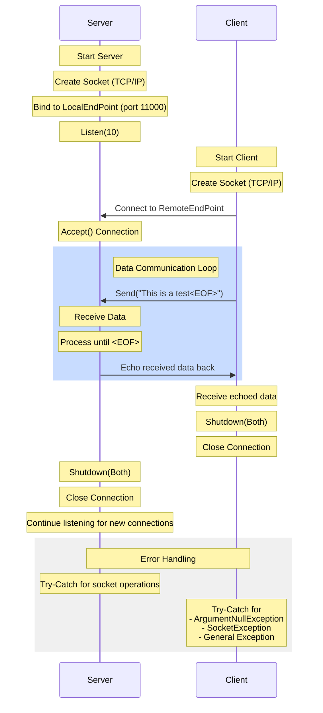

# Sequence Diagram  
    
## TCP/IP - 서버와 클라이언트 통신을 API 호출 중심으로 시퀸스 다이어그램
   

```mermaid
sequenceDiagram
    participant Server as TCP Server
    participant Client as TCP Client
    
    Note over Server: Socket()
    Note over Server: Bind()
    Note over Server: Listen()
    
    Note over Client: Socket()
    Client->>Server: Connect()
    Note over Server: Accept()
    
    rect rgb(200, 220, 255)
        Note right of Server: Data Communication
        Client->>Server: Send()
        Server-->>Client: Receive()
        Server->>Client: Send() 
        Client-->>Server: Receive()
    end
    
    Client->>Client: Close()
    Server->>Server: Close()
    
    Note over Server,Client: Connection Terminated
```
   
   
## BasicSocketClient - BasicSocketServer 시퀸스 다이어그램 
  

```mermaid   
sequenceDiagram
    participant Server
    participant Client
    
    Note over Server: Start Server
    Note over Server: Create Socket (TCP/IP)
    Note over Server: Bind to LocalEndPoint (port 11000)
    Note over Server: Listen(10)
    
    Note over Client: Start Client
    Note over Client: Create Socket (TCP/IP)
    Client->>Server: Connect to RemoteEndPoint
    
    Note over Server: Accept() Connection
    
    rect rgb(200, 220, 255)
        Note right of Server: Data Communication Loop
        Client->>Server: Send("This is a test<EOF>")
        Note over Server: Receive Data
        Note over Server: Process until <EOF>
        Server->>Client: Echo received data back
    end
    
    Note over Client: Receive echoed data
    
    Note over Client: Shutdown(Both)
    Note over Client: Close Connection
    
    Note over Server: Shutdown(Both)
    Note over Server: Close Connection
    
    Note over Server: Continue listening for new connections
    
    rect rgb(240, 240, 240)
        Note over Server,Client: Error Handling
        Note over Server: Try-Catch for socket operations
        Note over Client: Try-Catch for<br/>- ArgumentNullException<br/>- SocketException<br/>- General Exception
    end
```  
    