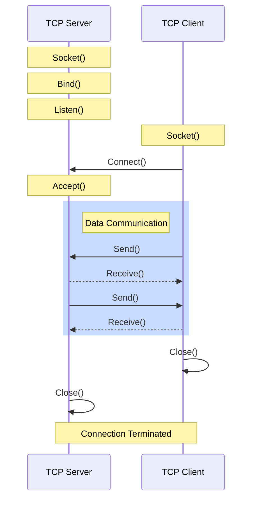
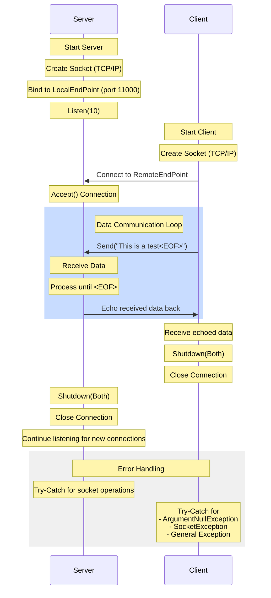
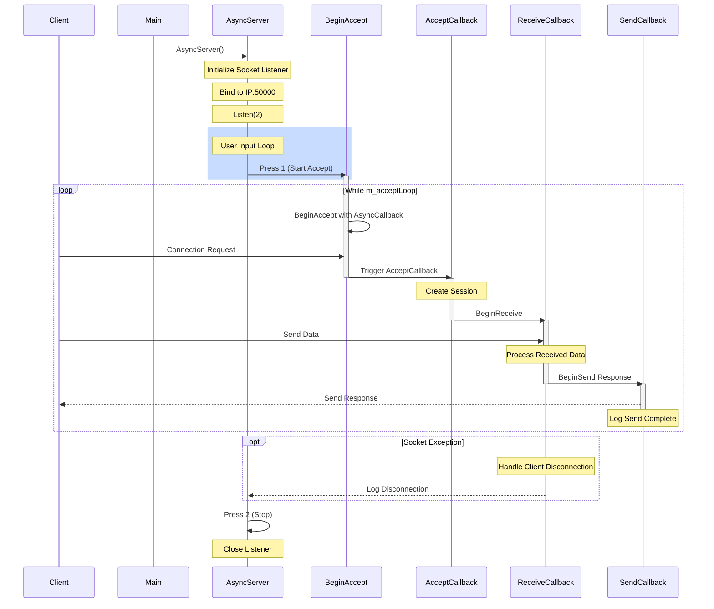
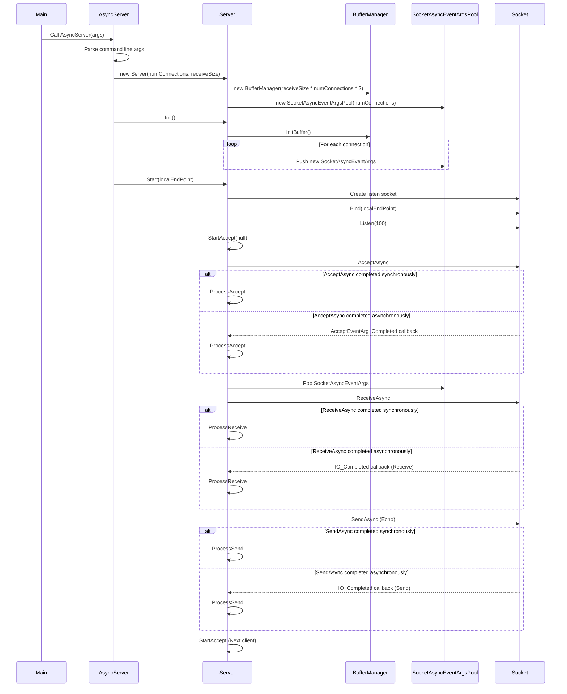
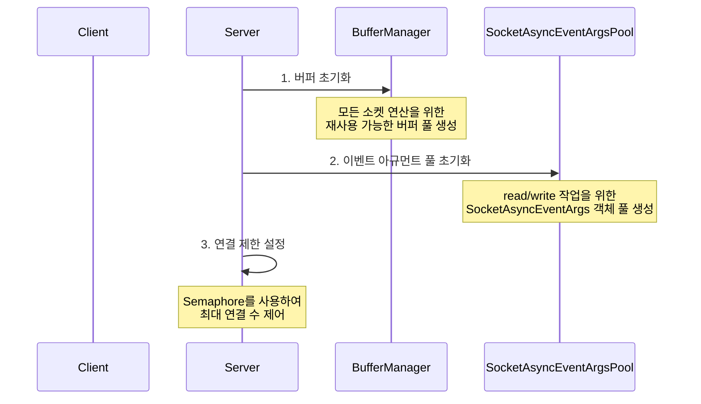
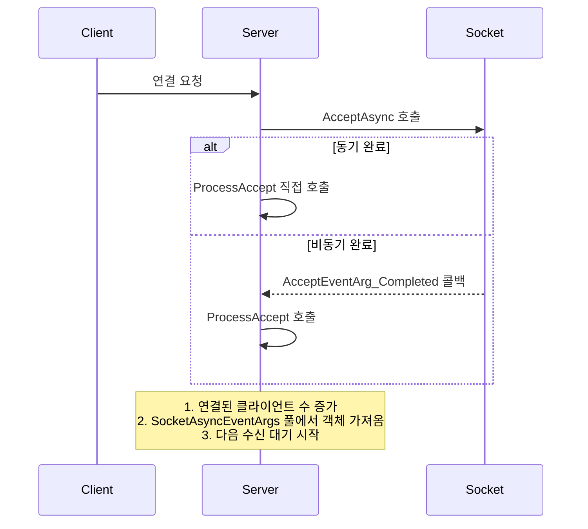
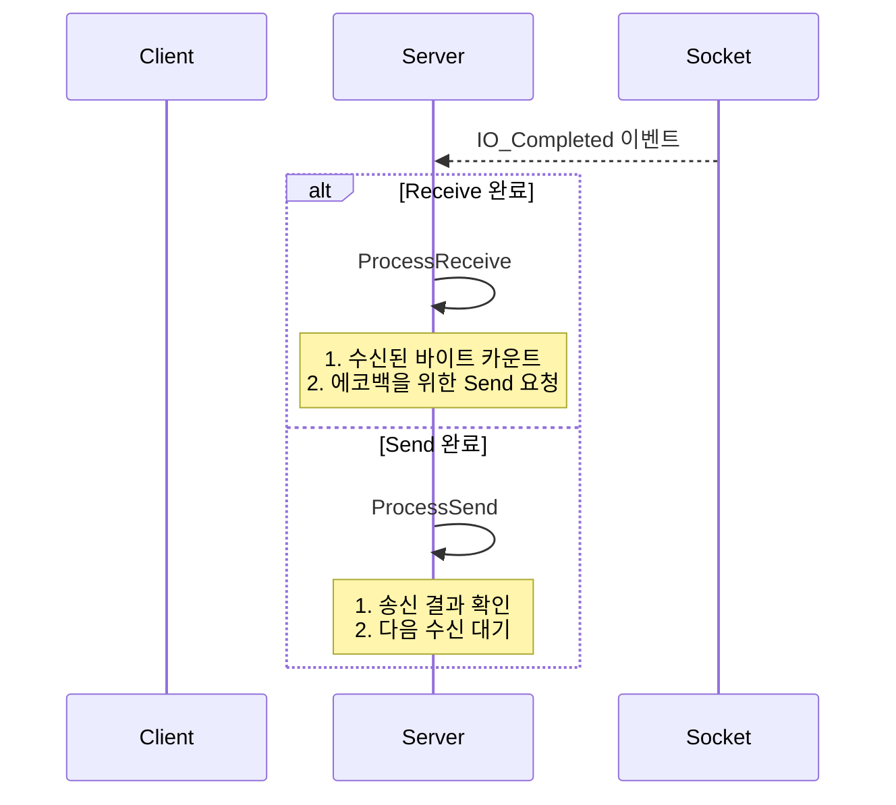

# Sequence Diagram  
    
## TCP/IP - 서버와 클라이언트 통신을 API 호출 중심으로 시퀸스 다이어그램
   

   
   
## BasicSocketClient - BasicSocketServer 시퀸스 다이어그램 
  

    
## BasicAsyncSocketServer 시퀸스 다이어그램
  

  
## AsyncSocketServer 시퀸스 다이어그램
  

### Server 클래스의 주요 역할은 다음과 같습니다:
  
1. 초기화 및 설정    

  
2. 클라이언트 연결 처리  

  
3. 데이터 송수신 처리  

  
#### 주요 특징:
1. 비동기 이벤트 기반 처리
   - AcceptAsync, ReceiveAsync, SendAsync 메소드를 사용
   - 콜백을 통한 비동기 완료 처리

2. 리소스 관리
   - BufferManager: 메모리 단편화 방지를 위한 버퍼 풀 관리
   - SocketAsyncEventArgsPool: 이벤트 아규먼트 객체 재사용
   - Semaphore: 동시 연결 수 제어

3. 에코 서버 기능
   - 수신된 데이터를 그대로 클라이언트에게 재전송
   - 연속적인 송수신 처리

4. 연결 관리
   - 클라이언트 연결 수 추적
   - 비정상 연결 해제 처리
   - 연결 해제 시 리소스 정리 및 재사용
  
이러한 구조를 통해 Server 클래스는 확장성이 높고 효율적인 비동기 소켓 서버를 구현합니다.
  

     
